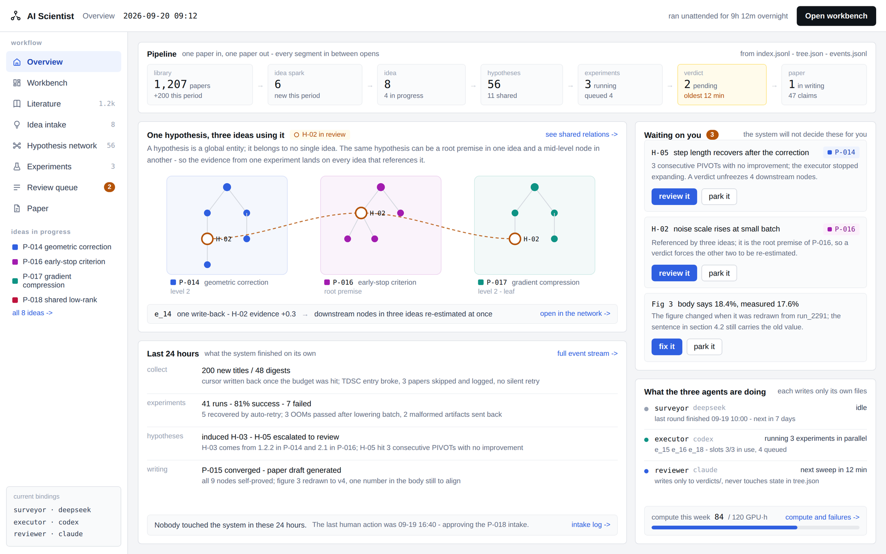

# AI Scientist: a dynamic hypothesis–evidence forest

English · [中文](README.md)

A **working interface** for an autonomous research system: read the literature, form
hypotheses, run experiments, rule on the evidence, write the paper — the whole chain on one
shared network of hypotheses. Front end and back end, no dependencies, `npm start`.

> The whole design follows from one decision: **a hypothesis is a global entity and belongs
> to no single project.** The same hypothesis can be a root premise in one project, a middle
> node in another and a proven leaf in a third — so evidence from one run lands on every
> project that cites it, and overturning it costs each of them something different.
> The long version: [docs/CONCEPTS.md](docs/CONCEPTS.md).



---

## Run it

```bash
npm start          # → http://localhost:8080
npm test           # 366 end-to-end assertions
```

Node 18+, **no dependencies and no build step**. `PORT=3000 npm start` for another port.

Every visitor gets a private demo workspace, keyed by a session cookie and stored as JSON
under `data/sessions/`. Your changes are yours; the footer has a reset link.

---

## It is not a mockup

The buttons on all 19 screens really change state, and the consequences show up wherever
they belong:

- **Queue a run** → it waits for a slot, starts, streams output, finishes on its own clock,
  and writes signed evidence back to its hypothesis — **updating every project that cites
  it at once**. Come back an hour later and the queue has drained exactly as it would have
  while you watched.
- **PROCEED / REFINE / PIVOT / escalate.** Three PIVOTs in a row, or cumulative evidence
  past −1.0, and the executor stops expanding and hands the hypothesis to the verdict queue.
- **Rule on a shared hypothesis** and watch it land differently in each project: the one
  where it is a root premise reopens entirely, the one where it is a mid-layer node freezes
  a branch, and the one with its own independent run is untouched. That is computed, not
  copywriting.
- **Launch a candidate project**: choose which existing hypotheses to reuse, and the new
  tree wires itself into the shared network — reused nodes simply gain a citing project
  instead of being re-verified.
- **Soften an overclaim** and the sentence changes in the manuscript. Apply a figure-review
  comment and the figure is redrawn and its section flagged. Leave an overclaim in place and
  the submission export refuses to build.
- **The panorama** pans, zooms and lets you drag nodes; shared hypotheses sit between the
  clusters that share them.

Chinese and English switch live from the header — one site, not two.

---

## The 19 screens

| Group | Screens |
| --- | --- |
| Entry | `/` long scrolling landing page · `/home` overview · `/main` workbench (global frontier) |
| Literature | `/survey` collection · `/trends` trend analysis · `/sparks` idea sparks · `/digest` paper detail |
| Intake & hypotheses | `/ideas` intake · `/panorama` panorama · `/graph` shared hypotheses · `/tree` single-project tree |
| Experiments | `/experiments` single run · `/exptree` four-stage tree · `/sweep` sweep matrix · `/runs` compute & failures |
| Verdicts & writing | `/review` verdict queue · `/paper` manuscript · `/claims` claims vs evidence · `/figures` figures · `/rebuttal` review & rebuttal |
| Other | `/events` full event stream |

---

## Connecting real research data

The demo runs on placeholder data shaped like the real thing. Point it at a project:

```bash
AIS_SOURCE=project AIS_PROJECT_DIR=/path/to/project npm start
npm run check-project /path/to/project   # read a directory and report what is in it
npm run demo-project                     # try the sample directory in this repo
```

It reads `tree.json` (projects, hypotheses, trees), `experiments.jsonl`, `events.jsonl`,
`index.jsonl`, `verdicts/`, `venues.yaml`, `topics.md` and an optional `paper/`, re-reading
them whenever they change — no restart.

The key design point: **the workbench is a decision surface, not a second writer.**

| The human does | The workbench writes |
| --- | --- |
| rules on a hypothesis | `verdicts/<hyp>.json` |
| queues a run | one line in `queue.jsonl` |
| anything at all | one line in `events.jsonl` with `"module": "human"` |

Everything else — `tree.json`, `index.jsonl`, `experiments.jsonl`, `artifacts/` — belongs to
the agents. Actions that would edit them are refused with a message saying so, and the
simulated clock is off: a run finishes when the executor says it did. `AIS_READONLY=1` makes
it look-only. Malformed rows are reported line by line instead of breaking the page,
single-language strings show on both sides of the switch, and sections a project has not
filled in render as empty states.

The full field contract is in [docs/DATA.md](docs/DATA.md).

## Documentation

| | |
| --- | --- |
| [docs/CONCEPTS.md](docs/CONCEPTS.md) | the forest model: shared hypotheses, signed evidence, how a verdict propagates |
| [docs/DATA.md](docs/DATA.md) | the file contract for connecting a real project |

---

## Layout

```
server/
  index.js     HTTP server, static files, /api/view + /api/act   (no framework)
  seed.js      the demo workspace — every string bilingual
  engine.js    derived state: frontier, roles, impact, the simulation clock
  views.js     one builder per screen; the client only renders
  actions.js   every button in the product, one function each
  input.js     argument hygiene: length caps, id checks, per-language edits
  store.js     session workspace persistence (LRU + disk)
  source/      where the data comes from: demo simulation or a project directory
  selftest.js  npm test
tools/check-project.js    read a project directory and report what is in it
fixtures/project-sample/  a small, deliberately imperfect project directory
public/
  css/app.css  the design system taken from the mockups
  js/core.js   language, API, formatting, UI atoms
  js/app.js    router and workbench shell
  js/landing.js
  js/screens/  overview · lit · hyp · exp · write
```

Two endpoints: `GET /api/view?screen=<name>` returns everything one screen needs, and
`POST /api/act {op, args}` applies one action and returns a bilingual toast. **All logic
lives on the server**, so the screens stay consistent with each other by construction.

---

## Deploying

The included [render.yaml](render.yaml) configures a free Render Node.js Web Service:
branch `main`, build `npm install`, start `npm start`, and health check `/api/health`.
The server binds to `0.0.0.0:$PORT` with `AIS_SOURCE=demo` and a private session per visitor.
The public demo uses demo data and simulated experiments only. Do not configure real project
directories, model API keys, or live experiment executors.

When connected through GitHub, normal pushes to `main` trigger deployment; run `npm test` before updating.
Services created from a public Git URL require a manual deployment of the latest commit in Render.
Free services sleep after 15 idle minutes and take about a minute to wake up. Sleep, restarts,
and redeploys reset trial data. A workspace shares 750 free instance hours per month, with separate
bandwidth and build allowances. Do not enable paid instances, disks, or databases.
Without a payment method, exhausted allowances suspend services or builds; a workspace with a
payment method can incur overage charges. See [Render's free plan limits](https://render.com/docs/free).

A single Node process behind any reverse proxy. `data/sessions/` is the only writable
directory and old sessions are swept after seven days. For a multi-instance deployment,
replace `server/store.js` with a shared store — nothing else assumes local disk.

---

## Copyright

© 2026 Nanyang Technological University, Singapore. All rights reserved.

This repository carries **no open-source licence**: the code is public to read, but no
rights to copy, modify or redistribute are granted. Please get in touch before using it.

The mark in the footer is a **placeholder, not the university's official logo**. Replace
`public/assets/ntu-mark.svg` with an approved asset, or remove it, before any formal release.
