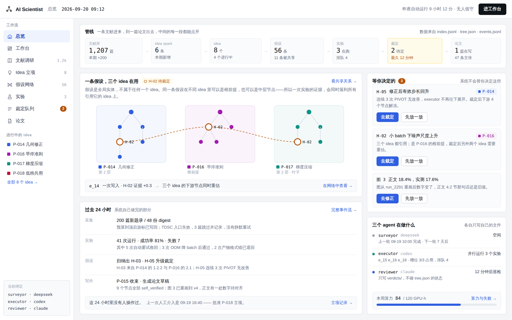

# AI 科学家：动态假设-证据森林系统

[English](README.en.md) · 中文

一个自动化科研系统的**可操作界面**：读文献、提假设、跑实验、裁定证据、写论文，
整条链路在同一张假设网络上展开。前后端齐全，零依赖，`npm start` 就能跑。

> 核心设计只有一句：**假设是全局实体，不属于任何一个课题。**
> 同一条假设在三个课题里可以分别是根前提、中层节点和已证叶子——
> 所以一次实验的证据会同时落到所有引用它的课题上，而推翻它的后果，三边各不相同。
> 展开讲在 [docs/CONCEPTS.zh-CN.md](docs/CONCEPTS.zh-CN.md)。



---

## 跑起来

```bash
npm start          # → http://localhost:8080
npm test           # 366 条端到端断言
```

Node 18+，**没有依赖、没有构建步骤**。`PORT=3000 npm start` 换端口。

每位访客拿到一份独立的演示工作区（cookie 标识，存成 `data/sessions/` 下的 JSON），
你的改动只属于你，页脚有重置入口。

---

## 它不是样稿

19 个界面里的按钮都真的会改状态，而且改动会传到该去的地方：

- **排一个实验** → 等槽位 → 开跑 → 实时流输出 → 按自己的时钟跑完 →
  带符号的证据写回假设，**所有引用它的课题同时更新**。
  离开一小时再回来，队列会按当时该有的样子排空。
- **PROCEED / REFINE / PIVOT / 提交裁定**。连续三次 PIVOT，或累积证据跌破 −1.0，
  executor 自动停止展开并把假设交给裁定队列。
- **裁定一条共享假设**，三个课题后果各不相同：根前提所在的那棵树整体重开，
  中层节点冻结一条分支，已有独立证据的叶子不受影响。这是真算出来的，不是文案。
- **立项一个候选课题**：勾选复用哪些已有假设，新树接进共享网络——
  被复用的节点只是多了一个引用方，不重跑。
- **改掉一句过度声称**，正文同步改写；采纳审图意见，图重绘并把对应小节标为待复核；
  过度声称没改完，打包投稿版会被拦下并列出是哪几条。
- **假设全景图**可滚轮缩放、拖拽平移、拖动节点，共享假设落在共用它的课题之间。

中英文在页面顶部一键切换，不是两个站；语言偏好记在浏览器里。

---

## 19 个界面

| 分组 | 界面 |
| --- | --- |
| 入口 | `/` 长滚动介绍页 · `/home` 总览 · `/main` 工作台（全局 frontier） |
| 文献调研 | `/survey` 采集管线 · `/trends` 趋势分析 · `/sparks` idea spark · `/digest` 论文详情 |
| 立项与假设 | `/ideas` 立项 · `/panorama` 假设全景 · `/graph` 共享关系 · `/tree` 单课题树 |
| 实验 | `/experiments` 单次实验 · `/exptree` 实验树（四阶段）· `/sweep` 扫描矩阵 · `/runs` 算力与失败 |
| 裁定与写作 | `/review` 裁定队列 · `/paper` 论文正文 · `/claims` 主张·证据对照 · `/figures` 图表工作台 · `/rebuttal` 审稿与修订 |
| 其他 | `/events` 完整事件流 |

---

## 接真实科研数据

演示模式跑的是形状与真实数据一致的占位数据。指向一个真实项目目录：

```bash
AIS_SOURCE=project AIS_PROJECT_DIR=/path/to/project npm start
npm run check-project /path/to/project   # 先体检：读出来什么、有哪些问题
npm run demo-project                     # 用仓库自带的样例目录试试
```

读取 `tree.json`（课题/假设/树）、`experiments.jsonl`、`events.jsonl`、`index.jsonl`（文献）、
`verdicts/`、`venues.yaml`、`topics.md` 以及可选的 `paper/`。文件一变就重读，不用重启。

设计上的关键一点：**工作台是决策面，不是第二个写入者。**

| 人做了什么 | 工作台写什么 |
| --- | --- |
| 裁定一条假设 | `verdicts/<hyp>.json` |
| 排一个实验 | `queue.jsonl` 追加一行 |
| 任何操作 | `events.jsonl` 追加一行 `"module": "human"` |

其余文件——`tree.json`、`index.jsonl`、`experiments.jsonl`、`artifacts/`——属于 agent，
会写到它们的操作一律拒绝并说明理由；项目模式下模拟时钟关闭，实验什么时候完成由 executor 说了算。
`AIS_READONLY=1` 只读。坏数据逐行报告而不是崩掉；单语字符串自动在中英两侧显示；
项目还没有的板块显示空状态。

完整字段契约：[docs/DATA.md](docs/DATA.md)（英文，面向机器的规格）。

---

## 工程结构

```
server/
  index.js     HTTP 服务、静态文件、/api/view + /api/act（无框架）
  seed.js      演示工作区的初始数据，每条字符串双语
  engine.js    派生状态：frontier、角色、失效影响、模拟时钟
  views.js     一屏一个构造函数，客户端只负责渲染
  actions.js   产品里的每一个按钮，一个函数一个
  input.js     输入净化：长度上限、id 校验、按语言写入
  store.js     会话工作区持久化（LRU + 磁盘）
  source/      数据来自哪里：演示模拟 或 真实项目目录
  selftest.js  npm test
tools/check-project.js    体检一个项目目录
fixtures/project-sample/  一份故意留了脏数据的样例目录
public/
  css/app.css  取自设计稿的设计系统
  js/core.js   语言、API、格式化、UI 原子组件
  js/app.js    路由与工作台外壳
  js/landing.js
  js/screens/  overview · lit · hyp · exp · write
```

API 只有两个端点：`GET /api/view?screen=<name>` 返回一屏需要的全部数据，
`POST /api/act {op, args}` 执行一个动作并返回双语提示。
**全部逻辑在服务端**，所以各屏之间的一致性是结构性的，不靠约定。

---

## 部署

单个 Node 进程，前面挂任意反向代理即可。`data/sessions/` 是唯一需要写权限的目录，
七天后自动清理。多实例部署时替换 `server/store.js` 为共享存储，其余代码不假设本地磁盘。

---

## 版权

© 2026 新加坡南洋理工大学（Nanyang Technological University, Singapore）。保留所有权利。

本仓库**未附开源许可证**：代码公开可读，但未授予复制、修改或再分发的权利。
需要使用请先联系作者。

页脚的校徽为**占位图形，不是学校官方标识**；对外正式发布前请替换
`public/assets/ntu-mark.svg` 为经授权的标识，或移除。
